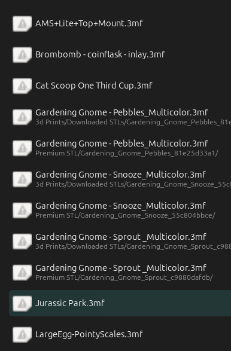
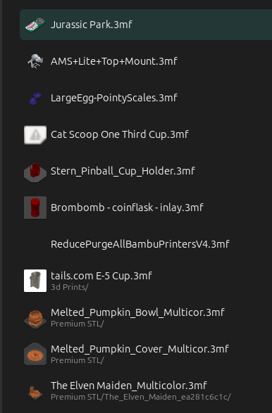

# Oraca Slicer 3mf Thumbnail Icon Generator for Ubuntu

Tired of having broken looking icons for your 3mf files?

Make them looks better like this

 

[toc]

## Installation

run the helper install script, with sudo.  It will install the required packages and move the files to the correct locations. Sudo is needed to install the packages, and access the filesystem.

```sh
chmod +x install.sh
sudo ./install.sh
```


## Manual Installation
To make this actually work as a thumbnailer you have to save this under `/usr/bin/3mf-thumbnailer` and make it executable (`sudo chmod +x /usr/bin/3mf-thumbnailer`).

>Note: You have to have 7zip and Python 3 installed.

Additionally, a .thumbnailer file needs to be created in `/usr/share/thumbnailers/3mf.thumbnailer` with the following content so that the thumbnail service knows how to generate them.

```
[Thumbnailer Entry]
Type=X-Thumbnailer
Name=3mf Thumbnailer
TryExec=python3
Exec=3mf-thumbnailer %i %o
MimeType=model/3mf;application/vnd.ms-3mfdocument;application/x-3mf;
```

This works with Nautilus (and other Gnome file managers).

Now you have thumbnails for 3MF files that contain PNG thumbnails.

In case the 3MF file doesn't include a thumbnail, this falls back to the generic "broken" icon. It doesn't support multi-disk zip archives.

## Troubleshooting:

https://askubuntu.com/questions/1368910/how-to-create-custom-thumbnailers-for-nautilus-nemo-and-caja

#### Credits:
Thank you to **u/MatureHotwife** on Reddit for the initial question/answer.  I adapted their answer to work specifically with Orca Slicer.

https://www.reddit.com/r/3Dprinting/comments/132lesb/3mf_thumbnails_on_linux/